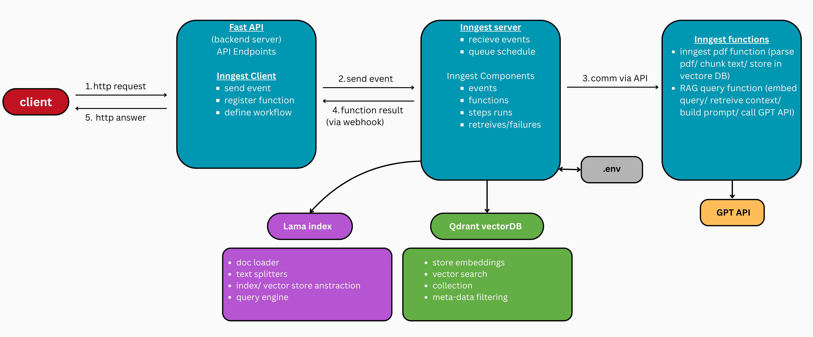

# RAG PDF Q&A System 📑
A RAG application built with Python, FastAPI, Inngest, OpenAI Embeddings, LlamaIndex, and Qdrant Vector Database.  
The system ingests PDF documents, splits them into semantic chunks, generates vector embeddings, and stores them in Qdrant for efficient similarity search. When a user submits a question, the application retrieves the most relevant document chunks and uses an LLM to generate context-aware answers grounded in the retrieved content.

## Features
* PDF document ingestion and processing
* Automatic text chunking using LlamaIndex
* Vector embedding generation with OpenAI Embeddings
* Qdrant Vector Database integration
* RAG workflow
* FastAPI backend
* Inngest event-driven workflows
* Context-aware question answering with OpenAI GPT models

## Tech Stack
* Python
* FastAPI
* Inngest
* OpenAI API
* LlamaIndex
* Qdrant
* Pydantic
* Docker (for Qdrant)

## Workflow
1. Upload and ingest PDF documents.
2. Extract and split text into chunks.
3. Generate embeddings for each chunk.
4. Store embeddings and metadata in Qdrant.
5. Convert user questions into embeddings.
6. Retrieve the most relevant document chunks.
7. Generate answers using an LLM based on the retrieved context.

   
